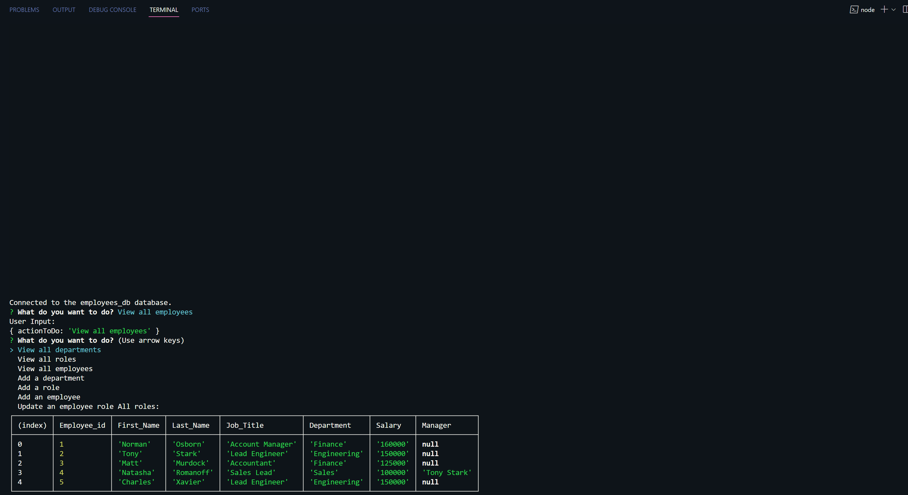

# Employee-Tracker
## Description:
This application was made to manage the employees from a company, so that is easy to maintain the information of each one of them inside ordered tables, and so that is easy also to modify some aspects of it.

This is an easy way to manage data in an ordered way, and to visualize it in a table form.
It was achive by using *mysql2*, *inquirer* and *mysql*.

---

### How to run the project : 
To run the project, you just need to open an integrated terminal and run the command **"npm start"**, and you will be prompted with the diferent options available inside the tables. Each one of them tells you what you need to do to complete each prompt.

### Example img :

## Student info:
**Student GitHub Repo link :** https://github.com/BryanGC96/Employee-Tracker

**Application video example link :** https://drive.google.com/file/d/1JoTFy4gPSOdSCND7tk04MUwA98R4FBwz/view?usp=sharing 
